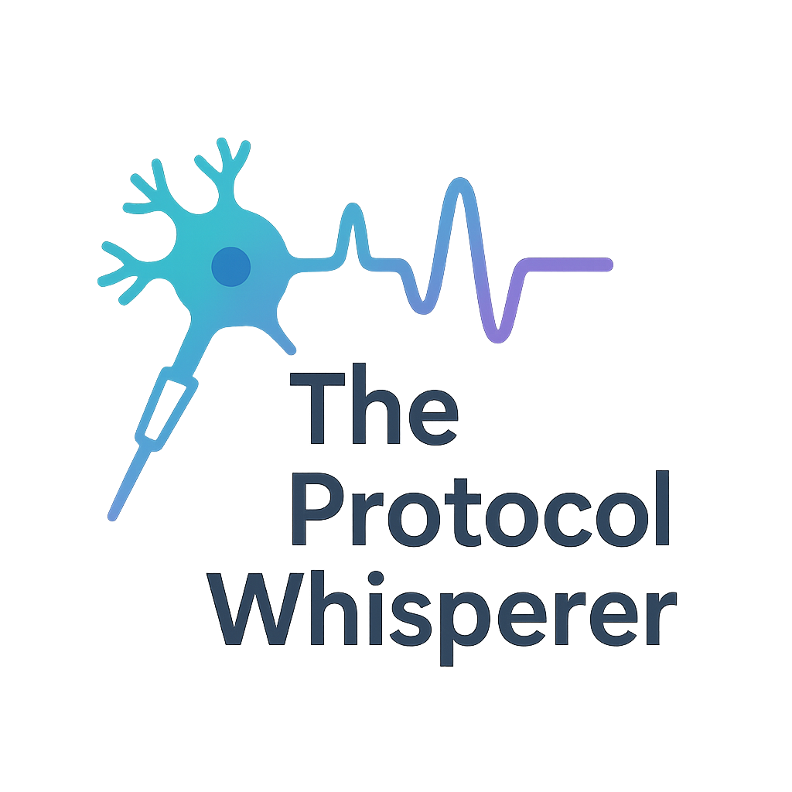

# The Protocol Whisperer

This app allows you to create custom stimulation waveforms compatible with pCLAMP. The waveforms are based on the stimgen part of [LCG](https://github.com/danielelinaro/LCG).

This is a temporary WIP implementation in MATLAB.
