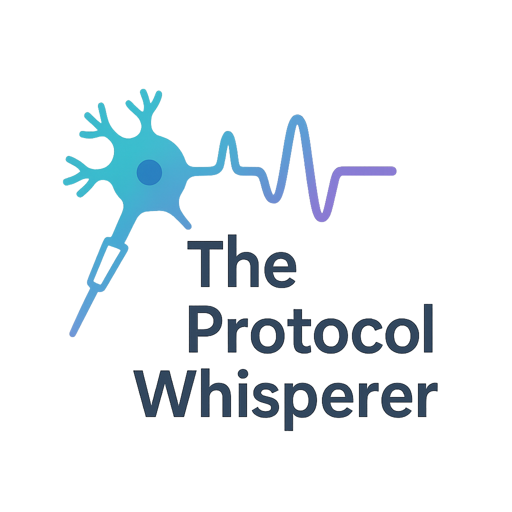

# The Protocol Whisperer

This app allows you to create custom stimulation waveforms compatible with pCLAMP. The waveforms are based on the stimgen part of <a href="https://github.com/danielelinaro/LCG" target="_blank">LCG</a>.
This is a temporary WIP implementation in MATLAB.

## Contributors
<a href="https://github.com/adam-says">Adam Armada-Moreira</a>

<a href="https://github.com/LauraMonni1">Laura Monni</a>

<a href="https://github.com/mgiugliano">Michele Giugliano</a>
